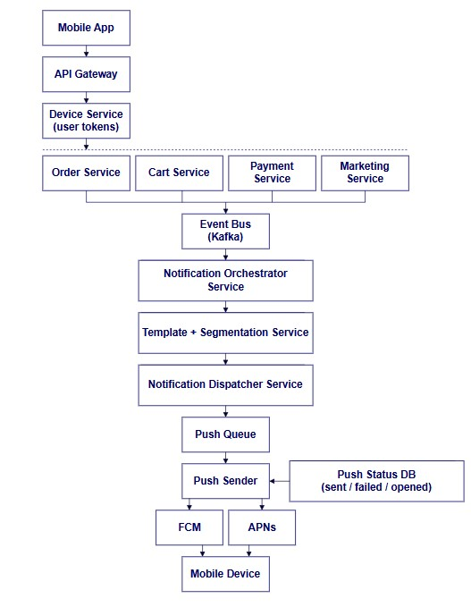

# Архитектура: отправка PUSH‑уведомлений

## Контекст

В мобильное приложение интернет‑магазина должны приходить PUSH‑уведомления разного типа -
например, уведомление о том, что корзина долго лежит без активности, об отмене заказа, а также рекламные рассылки.
Бэкенд предполагается микросервисным.

Цель - показать верхнеуровневую архитектуру системы отправки PUSH‑уведомлений, от генерации события до доставки пользователю.



## Подробное описание архитектуры PUSH‑уведомлений

## 1. Mobile App

На мобильном устройстве приложение регистрируется для получения push‑уведомлений, получая уникальный *device token* от сервисов FCM / APNs. Этот токен затем отправляется на сервер (через API), чтобы бэкенд знал, куда отправлять уведомления.

---

## 2. API Gateway

API Gateway принимает REST‑запросы от мобильного приложения (например, регистрация токена, обновление предпочтений) и маршрутизует их на соответствующие сервисы. Он также выполняет общие функции безопасности, аутентификации и управления трафиком.

---

## 3. Device Service (User Tokens)

Этот сервис отвечает за:

* хранение device‑токенов (для разных платформ)
* управление актуальными токенами
* проверку статуса подписки пользователя на уведомления

Это важно, поскольку для отправки пушей нужен действующий токен, и при его устаревании его следует удалять из системы.

---

## 4. Источники событий (микросервисы):

Здесь находятся бизнес‑сервисы, которые генерируют события, на которые нужно отправить уведомления:

### Cart Service

Генерирует события, например:

* корзина ‑ нет активности

### Order Service

Генерирует уведомления:

* отмена заказа
* изменение статуса заказа

### Payment Service

Генерирует события, связанные с платежами:

* успешный платёж
* отказ
* возврат

### Marketing Service

Генерирует маркетинговые события:

* рассылки
* акции и предложения

Все они работают независимо и являются источниками событий, которые отправляются в общую очередь событий.

---

## 5. Event Bus (Kafka)

Используется шина событий (например, Kafka), чтобы реализовать event‑driven архитектуру. Такой подход позволяет:

* асинхронно обрабатывать события
* гарантировать доставку событий
* масштабировать обработку по мере роста нагрузки

Каждый сервис публикует события в Kafka - и система уведомлений может подписаться на нужные топики.

---

## 6. Notification Orchestrator Service

Это центральный компонент, который:

1. Подписывается на события из Event Bus
2. Обрабатывает событие
3. Решает, какие уведомления нужно отправить
4. Может учитывать сегментацию, предпочтения пользователя и шаблоны
5. Публикует задачи на отправку уведомлений

Таким образом, Orchestrator:

* не отправляет пуши напрямую
* формирует правильный payload и контекст

---

## 7. Template + Segmentation Service

Этот сервис отвечает за:

* хранение шаблонов уведомлений
* применение данных к шаблону (например: цена, имя пользователя)
* сегментацию пользователей (например, только активные, только Android‑клиенты)

Это позволяет:

* повторно использовать тексты
* локализовывать/персонализировать уведомления
* учитывать предпочтения пользователя

---

## 8. Notification Dispatcher Service

Когда Orchestrator готовит уведомление, оно передаётся Dispatcher‑у, который:

1. Получает окончательный payload
2. Определяет конкретный канал доставки (APNs/FCM)
3. Готовит его для отправки в очередь отправки

---

## 9. Push Queue

Это внутренняя очередь, в которую складываются задачи на отправку пушей. Такая очередь позволяет:

* разгружать Notification Dispatcher
* обрабатывать отправку асинхронно
* реализовать retry‑логику, DLQ (dead‑letter queue) и др.

---

## 10. Push Sender

Push Sender - это компонент, который фактически взаимодействует с внешними push‑сервисами:

* FCM (Firebase Cloud Messaging) - Android и другие платформы
* APNs (Apple Push Notification service) - iOS

В процессе отправки Push Sender может также:

* обрабатывать ошибки, например, невалидные токены
* логировать статус отправки

---

## 11. Push Status DB (sent/failed/opened)

Хранит метрики и статусы:

* отправлено
* не доставлено
* открыто пользователем

Это важно для:

* отчётности
* повторных попыток
* аналитики эффективности уведомлений

---

## Итоговый поток данных

```
Mobile App → API Gateway → Device Service (token)  
Microservice (Order/Cart/Payment/Marketing)  
→ Event Bus (Kafka)  
→ Notification Orchestrator  
→ Template + Segmentation  
→ Notification Dispatcher  
→ Push Queue  
→ Push Sender  
→ FCM/APNs  
→ Mobile Device
```

---

## Почему такая архитектура

* Event‑Driven подход через Kafka позволяет масштабировать систему и обрабатывать уведомления независимо от бизнес‑логики микросервисов.
* Разделение обязанностей (Orchestrator, Dispatcher, Template Service) облегчает поддержку и позволяет расширять систему (новые типы уведомлений, кастомизация).
* Асинхронность и очереди обеспечивают надёжность и устойчивость, особенно при пиковых нагрузках.